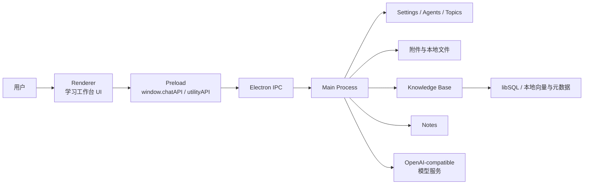

# UniStudy

UniStudy 是一个基于 Electron 的桌面端个人 AI 学习终端。项目围绕“学科 / 主题 / 对话 / 资料 / 笔记”组织学习过程，提供多学科入口、多话题历史、流式 AI 对话、交互式内容渲染、Source 资料检索、Notes 学习笔记、附件集中存储与可打包分发能力。

当前代码处于面向个人学习工作台持续演进的阶段，适合本地开发、内部试用、教学演示与学习助手原型验证。

## 目录

- [功能概览](#功能概览)
- [技术栈](#技术栈)
- [快速开始](#快速开始)
- [运行配置](#运行配置)
- [项目结构](#项目结构)
- [核心架构](#核心架构)
- [数据目录与持久化](#数据目录与持久化)
- [主要模块说明](#主要模块说明)
- [测试与质量保障](#测试与质量保障)
- [打包与分发](#打包与分发)
- [常见问题](#常见问题)
- [开发约定](#开发约定)
- [已知边界与后续方向](#已知边界与后续方向)

## 功能概览

### 学习工作台

- **Agents 学科入口**：左侧上半区用于组织不同学科、课程或学习助手。
- **Topics 话题历史**：每个 Agent 下可维护多个学习话题，支持新建、切换、重命名、删除、锁定、未读标记与 Markdown 导出。
- **Chat 对话区**：中间区域承载用户与 AI 的学习对话，支持流式回复、中断请求、历史持久化与高保真消息渲染。
- **Source 资料区**：右侧 Source 面板管理当前话题绑定的资料，支持上传、解析、切片、向量检索与上下文注入。
- **Notes 笔记区**：右侧 Notes 面板支持从聊天气泡收藏 / 生成笔记，并提供按 Topic 或 Agent 聚合查看的能力。
- **Settings 设置区**：集中配置模型服务、Agent 信息、Prompt、渲染偏好、主题与学习相关选项。

### AI 与学习能力

- 支持 OpenAI-compatible 风格的聊天、嵌入和重排服务配置。
- 内置模型服务配置体系，支持 OpenAI、OpenRouter、DeepSeek、SiliconFlow、DashScope Compatible、Ollama、LM Studio、OneAPI / NewAPI Compatible 与自定义兼容服务预设。
- 支持话题级 Source 检索增强生成：当前话题发送消息时优先检索并注入绑定资料。
- 支持后续追问生成、话题标题自动生成、笔记深度分析、选择题生成和闪卡生成等学习辅助能力。
- 支持学习画像、学习日志策略、每日笔记变量与学习记忆相关配置。

### 内容渲染与附件

- 支持 Markdown、代码块、图片、KaTeX、Mermaid、PreTeXt 等消息内容渲染能力。
- 支持裸 HTML / SVG 片段在聊天气泡内随流式输出逐步形成可交互学习界面。
- 支持 HTML 代码块 iframe 预览，以及 Three.js 代码块本地 vendor 预览和可见错误诊断。
- 流式渲染将原生思维链、稳定内容和活跃尾部内容分区管理，减少最终重绘闪烁。
- 支持文本 viewer 与图片 viewer 辅助窗口。
- 支持文件选择、粘贴图片 / 文件、拖拽文件到输入区。
- 附件由主进程集中落盘，历史记录保存中心化附件对象，避免依赖浏览器临时 URL。
- 支持用户头像、表情包、气泡主题、动态岛提示与多种聊天布局选项。

## 技术栈

- **运行时**：Node.js + Electron
- **主进程**：CommonJS 模块，负责窗口创建、IPC、数据目录、文件读写、模型请求、知识库和笔记服务
- **渲染层**：原生 HTML / CSS / JavaScript，按控制器拆分工作区、输入框、设置、Source、Notes、Reader 等功能
- **Preload**：通过受控 API 暴露主进程能力，运行时 bundle 由脚本生成
- **知识库**：本地 libSQL 存储元数据和向量，文档解析后进行切片、embedding、可选 rerank 与检索
- **文档处理**：支持 PDF、DOCX、纯文本、Markdown、CSV、HTML、JSON、XML、CSS 以及常见图片 MIME 类型
- **测试**：Node 原生 `node --test`、Vitest + jsdom、Electron smoke 脚本
- **打包**：electron-builder，支持 Windows / macOS / Linux 的打包脚本，当前文档重点覆盖 Windows 内部试分发

## 快速开始

### 环境要求

- Node.js：建议使用当前 LTS 版本。
- npm：随 Node.js 安装。
- Windows / macOS / Linux：Electron 理论上跨平台，当前项目启动脚本和打包说明对 Windows 更完整。
- 可访问 npm registry 与 Electron 下载镜像；国内网络环境可使用项目启动脚本内置的 npmmirror 配置。

### 安装依赖

```bash
npm install
```

Windows 用户也可以直接运行：

```bat
start.bat
```

`start.bat` 会检查依赖和 Electron 二进制是否完整，必要时自动执行 `npm install`，然后启动应用。

macOS / Linux 用户可使用：

```bash
./start.sh
```

或：

```bash
./start.command
```

### 启动开发版

```bash
npm start
```

启动流程会先构建 preload bundle，然后调用本地 Electron 二进制加载当前项目。

### 常用开发快捷键

- `F5`：刷新窗口
- `Ctrl+R`：刷新窗口
- `Ctrl+Shift+R`：强制刷新
- `Ctrl+Shift+I`：打开开发者工具

## 运行配置

### 应用数据目录

默认情况下，UniStudy 使用 Electron `app.getPath('userData')` 下的 UniStudy 名字空间保存运行数据。

如果需要指定独立数据目录，可设置环境变量：

```bash
UNISTUDY_DATA_ROOT=/path/to/unistudy-data
```

Windows PowerShell 示例：

```powershell
$env:UNISTUDY_DATA_ROOT="D:\UniStudyData"
npm start
```

### 模型服务配置

首次运行后，建议在应用的 Settings 面板中检查并配置：

- 聊天服务地址与 API Key
- 默认聊天模型
- 后续追问模型
- 话题标题生成模型
- embedding 模型
- rerank 模型
- Source / KB 相关地址与密钥

项目内置模型服务管理模块，支持多个 Provider 与不同任务默认模型。请勿把个人真实 API Key 提交到仓库。

### Source / 知识库配置

Source 能力依赖 embedding 服务；如果启用 rerank，还需要配置 rerank 服务。

默认知识库参数包括：

- `kbEmbeddingModel`：默认 embedding 模型
- `kbUseRerank`：是否启用 rerank
- `kbRerankModel`：默认 rerank 模型
- `kbTopK`：最终返回来源数量
- `kbCandidateTopK`：候选检索数量
- `kbScoreThreshold`：相似度阈值

## 项目结构

```text
.
├── docs/                         # 项目说明、测试报告、架构与打包文档
├── scripts/                      # 启动、打包、迁移、smoke 与 KB 验证脚本
├── src/
│   ├── assets/                   # 应用图标等静态资源
│   ├── main/                     # Electron 主进程入口
│   ├── modules/
│   │   ├── main/                 # 主进程业务模块
│   │   └── renderer/             # 渲染层与 viewer 辅助模块
│   ├── preloads/                 # preload 源码与运行时 bundle
│   ├── Promptmodules/            # Prompt 编辑与样式相关模块
│   ├── renderer/                 # 主页面 HTML、入口脚本与核心样式
│   └── styles/                   # 历史 / 共享样式资源
├── tests/                        # 主进程、渲染层、E2E 与 fixture 测试
├── vendor/                       # 第三方或本地打包所需资源
├── package.json                  # npm 脚本、依赖与 electron-builder 配置
├── start.bat                     # Windows 一键启动脚本
├── start.sh                      # Unix shell 启动脚本
└── start.command                 # macOS 双击启动脚本
```

## 核心架构

UniStudy 采用典型 Electron 三层结构：主进程管理系统能力与持久化，preload 负责桥接受控 API，renderer 负责界面状态与交互。



### 主进程入口

- `src/main/main.js`：应用启动、窗口创建、preload 绑定、核心服务初始化、IPC handler 注册、历史文件监听、Markdown 导出和应用生命周期管理。
- `src/modules/main/ipc/`：按领域拆分 IPC，包括聊天、Agent、设置、Source / KB、Notes、文件对话框、主题、模型服务、学习工具和表情包。
- `src/modules/main/utils/`：设置校验、Agent 配置管理、数据目录解析、模型服务、Prompt 变量和兼容迁移工具。

### Preload 桥接层

- `src/preloads/lite.js`：主窗口 preload 入口。
- `src/preloads/viewer.js`：viewer 窗口 preload 入口。
- `src/preloads/shared/`：将 shell、session、content 等 API 目录组合为渲染层可访问的受控能力。
- `src/preloads/runtime/`：构建后的 bundle，通常由脚本生成，不建议手工编辑。

### 渲染层

- `src/renderer/index.html`：主窗口页面结构。
- `src/renderer/renderer.js`：渲染层壳层，负责组合 store、控制器、API 与 UI 初始化。
- `src/modules/renderer/app/`：按功能拆分的控制器，包括 workspace、composer、settings、source、notes、reader、logs、flashcards、follow-ups、topic titles、layout 等。
- `src/modules/renderer/messageRenderer.js`：高保真消息渲染主模块。
- `src/modules/renderer/streamManager.js`：流式消息管理，负责思维链 / stable / tail 分区、morphdom 增量更新和流式状态收口。
- `src/modules/renderer/text-viewer.*` 与 `image-viewer.*`：文本 / 图片辅助查看器。

## 数据目录与持久化

运行时数据不应依赖源码目录。默认数据根由 Electron `userData` 决定，也可通过 `UNISTUDY_DATA_ROOT` 覆盖。

典型数据结构：

```text
<dataRoot>/
├── settings.json                 # 全局设置
├── Agents/                       # Agent 配置与话题列表
│   └── <agentId>/
│       └── config.json
├── UserData/                     # 用户数据、话题历史与头像
│   └── <agentId>/
│       └── topics/
│           └── <topicId>/
│               └── history.json
├── KnowledgeBase/                # Source / KB 文档与索引数据
├── Notes/                        # 学习笔记
├── StudyDiary/                   # 学习日记投影
├── StudyLogs/                    # 学习日志
├── avatarimage/                  # 头像图片资源
└── .tmp/                         # 临时日志与运行时文件
```

### Agent 与 Topic

- Agent 表示一个学科、课程、学习助手或学习场景。
- Topic 表示 Agent 下的一段具体学习上下文。
- Topic 记录可绑定独立的 Source / KnowledgeBase ID。
- 对话历史以 `history.json` 持久化。

### Source / KnowledgeBase

Source 底层复用知识库模块：

1. 用户在 Source 面板上传资料。
2. 主进程接收文件并写入集中存储。
3. 文档处理器解析 PDF / DOCX / 文本 / 图片等来源。
4. 内容被切分为 chunk。
5. embedding 服务生成向量。
6. 检索时按当前 Topic 绑定的资料集合召回相关 chunk。
7. 可选 rerank 后将来源上下文注入聊天请求。
8. 助手回复中的来源引用会持久化到历史记录中。

### Notes

- 支持从用户消息或助手消息收藏并生成笔记。
- 支持当前 Topic 笔记视图。
- 支持当前 Agent 聚合笔记视图。
- 支持基于笔记内容生成分析、测验和闪卡。

## 主要模块说明

### 聊天链路

- `src/modules/main/chatClient.js`：模型请求客户端，处理 OpenAI-compatible 请求、流式响应和错误归一化。
- `src/modules/main/ipc/chatHandlers.js`：聊天 IPC 主链，处理消息发送、上下文构建、Source 检索、流式事件、追问和话题标题生成。
- `src/modules/main/study/chatOrchestrator.js`：学习工具协议、学习记忆、日志和模型调用的编排层。
- `src/modules/renderer/app/composer/composerController.js`：输入区、附件、发送、中断和消息落盘相关交互。
- `src/modules/renderer/streamManager.js`：渲染层流式输出管理，保留正在运行的预览、表单、媒体和交互状态。

### 工作区与布局

- `src/modules/renderer/app/workspace/workspaceController.js`：Agent / Topic 加载、切换、渲染与上下文同步。
- `src/modules/renderer/app/layout/layoutController.js`：左右栏宽度、高度、响应式布局和可拖拽调整。
- `src/modules/renderer/app/store/appStore.js`：渲染层轻量状态中心。

### 设置与模型服务

- `src/modules/main/utils/settingsSchema.js`：设置默认值、字段校验、旧字段替换提示。
- `src/modules/main/utils/appSettingsManager.js`：设置文件读写、备份恢复和 schema 补全。
- `src/modules/main/utils/modelService.js`：Provider、模型、任务默认模型、端点规范化和兼容服务配置。
- `src/modules/renderer/app/settings/settingsController.js`：设置 UI 控制器。

### Source / KnowledgeBase

- `src/modules/main/knowledge-base/index.js`：知识库服务组合入口。
- `src/modules/main/knowledge-base/documentProcessor.js`：文档解析、切片和处理流程。
- `src/modules/main/knowledge-base/parserAdapter.js`：PDF、DOCX、文本和图片 MIME 识别与解析适配。
- `src/modules/main/knowledge-base/retrievalService.js`：embedding 检索和 rerank。
- `src/modules/main/knowledge-base/repository.js`：知识库数据读写。
- `src/modules/main/ipc/knowledgeBaseHandlers.js`：Source / KB IPC。
- `src/modules/renderer/app/source/`：Source 面板 UI、模型和操作。

### Notes 与学习工具

- `src/modules/main/ipc/notesHandlers.js`：笔记持久化与分析类任务 IPC。
- `src/modules/main/study/`：学习日志、学习记忆、学习工具协议和日记投影。
- `src/modules/renderer/app/notes/`：Notes 面板 DOM、操作和工具函数。
- `src/modules/renderer/app/flashcards/` 与 `quiz/`：闪卡和测验展示辅助。

### Viewer 与内容安全

- 主窗口、文本 viewer、图片 viewer 通过各自 preload 暴露受控 API。
- 渲染层包含安全 HTML 处理、CSS 作用域处理、消息引用、上下文菜单和可见性优化模块。
- 预览 iframe、动画、Three.js、media、canvas 和临时对象 URL 需要在 DOM 替换、消息删除、弹窗关闭或页面卸载时主动清理。
- 当前话题历史文件变动会优先按 message id 做局部同步；正在流式输出或正在编辑的消息不会被外部 watcher 覆盖。
- 项目历史文档中已有 Electron sandbox、CSP、远程资源与本地文件访问边界的安全审查记录，后续扩展 renderer 能力时应继续遵守最小暴露原则。

## 测试与质量保障

### 全量测试

```bash
npm test
```

该命令会顺序运行主进程测试、渲染层测试和受控 E2E 测试。

### 常用测试命令

```bash
npm run test:main
npm run test:renderer
npm run test:renderer:logic
npm run test:renderer:dom
npm run test:e2e:controlled
npm run test:chat-config
npm run test:data-root
```

### Electron smoke

```bash
npm run test:e2e:preload-bridge
npm run test:e2e:css-removal
npm run test:e2e:smoke
npm run test:e2e:citation-smoke
```

### KnowledgeBase / Source 验证

```bash
npm run test:kb:endpoints
npm run test:kb:smoke
npm run test:kb:real
```

测试报告会写入 `docs/test-reports/`。真实服务验证需要可用的模型服务和知识库相关配置。

## 打包与分发

### 通用命令

```bash
npm run pack
npm run dist
```

- `pack`：生成当前平台的目录版产物，适合本机快速验证。
- `dist`：生成当前平台的正式分发产物。

### Windows

```bash
npm run pack:win
npm run dist:win
```

- `pack:win`：生成 `dist/win-unpacked` 目录版，可直接运行 `UniStudy.exe`。
- `dist:win`：生成 NSIS 安装包与 portable 绿色版。

### macOS

```bash
npm run pack:mac
npm run dist:mac
```

### Linux

```bash
npm run pack:linux
npm run dist:linux
```

当前 `docs/windows-exe-packaging.md` 对 Windows 内部试打包说明最完整；正式对外发布还需要补充代码签名、自动更新、离线依赖与发布流程。

## 常见问题

### Electron 二进制缺失或启动失败

可删除不完整的 `node_modules/electron` 后重新安装：

```bash
npm install
npm start
```

Windows 用户可直接运行 `start.bat`，脚本会自动检查 Electron 安装完整性。

### 国内网络安装依赖慢

`start.bat` 默认设置了 npm、Electron 和 electron-builder 的 npmmirror 镜像。手动安装时也可按需设置：

```powershell
$env:npm_config_registry="https://registry.npmmirror.com"
$env:ELECTRON_MIRROR="https://npmmirror.com/mirrors/electron/"
$env:ELECTRON_BUILDER_BINARIES_MIRROR="https://npmmirror.com/mirrors/electron-builder-binaries/"
npm install
```

### Source 检索不可用

请检查：

- Settings 中是否配置 embedding 服务。
- `kbBaseUrl` / `kbApiKey` 或模型服务中的 embedding provider 是否可用。
- 上传文档是否已处理完成。
- 当前 Topic 是否绑定了对应 Source。
- 文档类型是否在支持范围内。

### 聊天请求失败

请检查：

- 聊天服务地址是否为 OpenAI-compatible 接口。
- API Key 是否有效。
- 默认模型是否存在且支持聊天能力。
- 代理、证书或本地服务端口是否可访问。

### 打包后数据丢失

应用运行数据不在源码目录中，而在 Electron `userData` 或 `UNISTUDY_DATA_ROOT` 指定目录中。打包产物升级、移动或卸载时，请先确认数据目录位置并备份。

## 开发约定

- 主进程能力优先放在 `src/modules/main/`，不要直接把系统能力暴露给 renderer。
- 渲染层功能优先放在 `src/modules/renderer/app/` 的对应控制器中，避免继续膨胀 `src/renderer/renderer.js`。
- preload API 应保持小而稳定，新增能力需通过明确 IPC channel 与参数校验实现。
- 运行时数据应写入 Electron `userData` 或 `UNISTUDY_DATA_ROOT`，不要写入源码目录。
- `src/preloads/runtime/*.bundle.js` 由构建脚本生成，通常不要手动修改。
- 不要提交个人真实 API Key、测试数据中的隐私内容或大体积运行产物。
- 修改设置 schema 时，同步更新默认值、校验逻辑、UI 和必要测试。
- 新增 Source / Notes / Chat 行为时，优先补充相邻测试或 smoke 验证。

## 已知边界与后续方向

### 当前边界

- 当前版本主要面向单用户、单机、本地数据目录使用。
- 当前 UI 以简体中文为主。
- Notes 以 Markdown 文本方式存储，暂未引入完整富文本编辑器。
- Source 底层仍复用 knowledge-base 命名和实现，部分内部字段尚未完全迁移为 Source 术语。
- Viewer 仍存在外部资源依赖，当前版本不承诺完整离线模式。
- Windows 内部试分发路径最完整；正式多平台发布仍需补齐签名、更新和回归流程。

### 后续方向

- 完善首次运行配置向导和服务连通性诊断。
- 继续收敛 renderer 复杂度，增强模块边界与测试覆盖。
- 强化 Source 引用展示、检索可解释性和资料管理体验。
- 扩展 Notes 到复习计划、间隔重复、导出和第三方同步。
- 本地化 viewer 外部依赖，提升离线可用性。
- 完善打包后自动 smoke、代码签名和正式发布流程。

## 相关文档

- `docs/lite-user-guide.md`：现有用户使用说明。
- `docs/development-progress.md`：当前开发状态记录。
- `docs/renderer-architecture-baseline.md`：渲染层架构基线。
- `docs/unistudy-e2e-smoke.md`：E2E smoke 测试说明。
- `docs/windows-exe-packaging.md`：Windows 打包与内部试发布说明。
- `docs/architecture-security-review-20260411.md`：架构与安全审查历史记录。
